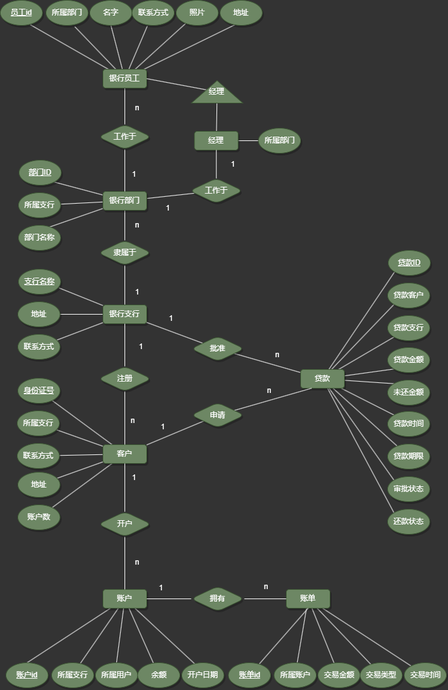

<div style="text-align:center;font-size:2em;font-weight:bold">中国科学技术大学计算机学院</div>

<div style="text-align:center;font-size:2em;font-weight:bold">《数据库系统实验报告》</div>


<div style="display: flex;flex-direction: column;align-items: center;font-size:2em">
<div>
<p>实验题目：银行管理系统</p>
<p>学生姓名：常文正</p>
<p>学生学号：PB21111706</p>
<p>完成时间：2024年5月25日</p>
</div>
</div>


<div style="page-break-after:always"></div>

## 需求分析

### 应用场景

银行管理系统是一个典型的数据库应用，涉及银行支行信息、客户信息、账户信息、贷款信息、银行部门信息、员工信息等实体，提供开户、销户、存款、取款、转账、贷款、查询等功能。

### 数据需求：

1. **银行支行信息**：
   - 包括支行名称、地址、联系方式等。
2. **客户信息**：
   - 包括客户姓名、身份证号、联系方式、地址、账户数量。
3. **账户信息**：
   - 包括账户ID，所属支行，所属用户，余额，开户日期。
4. **账单信息**：
   - 包括账单ID，所属账户，交易金额，交易类型，交易时间。
5. **贷款信息**：
   - 包括贷款ID、客户ID、贷款金额、贷款期限、审批状态、还款状态、未还金额。
6. **银行部门信息**：
   - 包括部门ID，部门名称、部门主管、部门联系方式等。
7. **员工信息**：
   - 包括员工ID，所属部门，员工姓名，联系方式、照片，地址。

### 功能需求：

#### 客户端功能：

1. **开户**：
   - 客户填写个人信息和开户信息，系统生成账户号码。
2. **销户**：
   - 客户申请销户，系统验证身份并处理相关信息。
3. **存款**：
   - 客户输入存款金额，系统更新账户余额。
4. **取款**：
   - 客户输入取款金额，系统验证余额并更新账户余额。
5. **转账**：
   - 客户输入转账金额和目标账户号码，系统验证并更新两个账户余额。
6. **贷款**：
   - 客户填写贷款申请表单，系统进行贷款审核并记录贷款信息。
7. **查账**：
   - 客户查询账户余额、交易记录、贷款信息等。

#### 银行端功能：

1. **客户信息管理**：
   - 员工查看、修改客户信息，包括个人信息和账户信息。
2. **贷款审核**：
   - 员工审核客户的贷款申请，记录审核结果。
4. **部门管理**：
   - 员工查看、管理银行部门信息，包括部门名称、主管、联系方式等。
5. **员工管理**：
   - 员工查看、管理员工信息，包括姓名、部门、联系方式等。

## 总体设计

### 系统模块结构

由于本次实验采用Django框架进行开发，因此后端采用MVC模式进行设计，前端采用HTML、CSS、JavaScript等技术进行设计，系统模块结构如下：

#### 后端：

通过建立了多个应用，每个应用负责一个模块的功能，如accounts应用负责账户管理，bills应用负责账单管理，branch应用负责支行管理，department应用负责部门管理，frontend应用负责前端页面管理，loans应用负责贷款管理，staffs应用负责员工管理，users应用负责用户管理。

每个应用中包含了模型、视图、路由、模板等文件，通过Django的ORM框架实现数据库操作，通过Django的template引擎实现前端页面渲染。

其中，模型文件定义了数据库模型，视图文件定义了视图处理函数，路由文件定义了路由映射，模板文件定义了前端页面模板。

#### 前端：

前端采用HTML、CSS、JavaScript等技术，使用Bootstrap框架进行页面布局，实现用户界面。

根据登录用户的不同，显示不同的页面，如客户登录后显示客户页面，银行工作人员登录后显示支行页面。

其中客户页面包括开户、销户、存款、取款、转账、贷款、查账等功能，支行页面包括客户信息管理、贷款审核、部门管理、员工管理等功能。

前端页面通过Django的模板引擎渲染，通过Django的路由映射实现页面跳转，主要部分由frontend应用负责，其中包括base.html、index.html、error.html等页面，分别用于页面基础模板、首页模板、错误页面模板。在其他每个应用中也包含了相应的模板文件，如accounts应用中包含了accounts.html、create_account.html、transfer.html等页面模板，这些页面大多都是通过继承base.html模板实现的，在每个页面中包含了相应的表单、表格、按钮等元素，通过JavaScript实现页面交互功能。

### 系统工作流程

**用户注册与登录**

- 用户通过前端页面进行注册，提交个人信息。
- 后端接收注册请求，验证信息的合法性，创建新用户。
- 用户通过前端页面登录，后端验证用户名和密码，成功后进入系统主页。

**账户管理**

- 用户登录后，可以在账户管理模块查看和管理个人账户信息。
- 后端从数据库中获取用户账户信息，通过视图传递给前端页面进行展示。
- 用户可以在前端页面进行账户信息的修改，前端将修改请求发送到后端，后端处理后更新数据库。

**账单管理**

- 用户可以查看账户的历史账单信息。
- 后端从数据库中获取账单信息，通过视图传递给前端页面进行展示。

**支行和部门管理**

- 管理员可以在支行和部门管理模块查看和管理各个支行和部门的信息。
- 后端从数据库中获取支行和部门信息，通过视图传递给前端页面进行展示。
- 管理员可以在前端页面修改或删除部门信息，前端将请求发送到后端，后端处理后更新数据库。

**员工管理**

- 管理员可以在员工管理模块查看和管理员工信息。
- 后端从数据库中获取员工信息，通过视图传递给前端页面进行展示。
- 管理员可以在前端页面添加、修改或删除员工信息，前端将请求发送到后端，后端处理后更新数据库。

**贷款管理**

- 用户可以申请贷款，查看贷款状态。
- 后端处理贷款申请请求，验证信息的合法性后创建贷款记录，更新数据库。
- 支行工作人员可以在贷款管理模块查看贷款申请，审批贷款。
- 用户可以查看贷款的还款记录和未还清余额等信息。

### 数据库设计

#### ER图：



#### 模式分解：

关系数据库模式如下：（表名：<u>主键名</u>  属性1 属性2 ...）

- 银行支行：<u>银行名称</u> 联系电话 所在城市
- 银行部门：<u>部门号</u> 银行名称 部门名称
- 员工：<u>工号</u> 部门号 姓名 电话，家庭住址 员工照片
- 经理：<u>工号</u> 部门号
- 客户：<u>身份证号码</u> 银行名称 姓名 电话 家庭住址 拥有账户数量
- 账户：<u>账户号</u> 身份证号码 银行名称 余额 开户日期
- 账单：<u>账单号</u> 账户号 发生时间 修改净值 余额 账单类型 交易备注
- 贷款：<u>贷款号</u> 身份证号码 银行名称 贷款总额 未还清余额 贷款日期 还款期限 贷款状态

可以明显地观察到，每个关系模式中，所有属性都是原子的，没有多值属性，也没有派生属性，所有属性都是完全依赖于主键，也没有传递依赖，其所有的函数依赖集如下：

- 函数依赖集 ~{银行支行}~ = \{ 银行名称 → 联系电话, 银行名称 → 所在城市 \}
- 函数依赖集 ~{部门}~ = \{ 部门号 → 银行名称, 部门号 → 部门名称 \}
- 函数依赖集 ~{员工}~ = \{ 工号 → 部门号, 工号 → 姓名, 工号 → 电话, 工号 → 家庭住址, 工号 → 员工照片 \}
- 函数依赖集 ~{客户}~ = \{ 身份证号码 → 银行名称, 身份证号码 → 姓名, 身份证号码 → 电话, 身份证号码 → 家庭住址, 身份证号码 → 拥有账户数量 \}
- 函数依赖集 ~{账户}~ = \{ 账户号 → 身份证号码, 账户号 → 银行名称, 账户号 → 余额, 账户号 → 开户日期 \}
- 函数依赖集 ~{账单}~ = \{ 账单号 → 账户号, 账单号 → 发生时间, 账单号 → 修改增值, 账单号 → 余额, 账单号 → 账单类型, 账单号 - → 交易金额 \}
- 函数依赖集 ~{贷款}~ = \{ 贷款号 → 身份证号码, 贷款号 → 银行名称, 贷款号 → 贷款总额, 贷款号 → 未还清余额, 贷款号 → 贷款日期, 贷款号 → 还款期限, 贷款号 → 贷款状态 \}

该函数依赖集合中，所有的函数依赖都是完全依赖于主键的，没有部分依赖，也没有传递依赖，因此这个关系模式是符合第三范式的。因此不再需要进行分解。

#### 存储过程、触发器、函数设计思路

由于本次实现采用的是Django框架，因此不需要设计存储过程、触发器、函数等数据库操作，而是通过Django的ORM框架来实现数据库操作，不过可以通过Django的信号机制来实现类似的功能，接下来在每个模块的设计中会详细介绍。

## 核心代码解析

### 仓库地址

https://github.com/AmberHeart/Database_Lab


### 目录

> 如下显示的文件结构中已经去除部分不重要的文件夹，比如migrations数据库迁移文件与pycache等缓存文件

```shell
D:.
│  manage.py ---- 项目管理命令文件
│
├─accounts ---- 应用目录，用于管理账户
│  │  admin.py ---- 管理员设置文件
│  │  apps.py ---- 应用配置文件
│  │  forms.py ---- 表单定义文件
│  │  models.py ---- 数据模型文件
│  │  tests.py ---- 测试文件
│  │  urls.py ---- 路由配置文件
│  │  views.py ---- 视图处理文件
│  │  __init__.py ---- 应用初始化文件
│  │
│  └─templates ---- 模板目录
│     └─accounts
│             accounts.html ---- 账户列表页面模板
│             create_account.html ---- 创建账户页面模板
│             transfer.html ---- 转账页面模板
│
├─bank ---- 项目设置目录
│     asgi.py ---- ASGI 配置文件
│     settings.py ---- 项目设置文件
│     urls.py ---- 项目路由配置文件
│     wsgi.py ---- WSGI 配置文件
│     __init__.py ---- 项目初始化文件
│
├─bills ---- 应用目录，用于管理账单
│  │  admin.py ---- 管理员设置文件
│  │  apps.py ---- 应用配置文件
│  │  forms.py ---- 表单定义文件
│  │  models.py ---- 数据模型文件
│  │  tests.py ---- 测试文件
│  │  urls.py ---- 路由配置文件
│  │  views.py ---- 视图处理文件
│  │  __init__.py ---- 应用初始化文件
│  │
│  └─templates ---- 模板目录
│     └─bills
│             bills.html ---- 账单列表页面模板
│             create_bill.html ---- 创建账单页面模板
│
├─branch ---- 应用目录，用于管理分行
│  │  admin.py ---- 管理员设置文件
│  │  apps.py ---- 应用配置文件
│  │  models.py ---- 数据模型文件
│  │  tests.py ---- 测试文件
│  │  urls.py ---- 路由配置文件
│  │  views.py ---- 视图处理文件
│  │  __init__.py ---- 应用初始化文件
│  │
│  └─templates ---- 模板目录
│     └─branches
│             branches.html ---- 分行列表页面模板
│
├─department ---- 应用目录，用于管理部门
│  │  admin.py ---- 管理员设置文件
│  │  apps.py ---- 应用配置文件
│  │  models.py ---- 数据模型文件
│  │  tests.py ---- 测试文件
│  │  urls.py ---- 路由配置文件
│  │  views.py ---- 视图处理文件
│  │  __init__.py ---- 应用初始化文件
│  │
│  └─templates ---- 模板目录
│     └─departments
│             departments.html ---- 部门列表页面模板
│             staffs.html ---- 员工列表页面模板
│
├─frontend ---- 应用目录，用于管理前端
│  │  admin.py ---- 管理员设置文件
│  │  apps.py ---- 应用配置文件
│  │  models.py ---- 数据模型文件
│  │  tests.py ---- 测试文件
│  │  urls.py ---- 路由配置文件
│  │  views.py ---- 视图处理文件
│  │  __init__.py ---- 应用初始化文件
│  │
│  └─templates ---- 模板目录
│     └─frontend
│             base.html ---- 基础页面模板
│             error.html ---- 错误页面模板
│             index.html ---- 首页模板
│
├─loans ---- 应用目录，用于管理贷款
│  │  admin.py ---- 管理员设置文件
│  │  apps.py ---- 应用配置文件
│  │  forms.py ---- 表单定义文件
│  │  models.py ---- 数据模型文件
│  │  tests.py ---- 测试文件
│  │  urls.py ---- 路由配置文件
│  │  views.py ---- 视图处理文件
│  │  __init__.py ---- 应用初始化文件
│  │
│  └─templates ---- 模板目录
│     └─loans
│             apply_loan.html ---- 申请贷款页面模板
│             approve_loan.html ---- 批准贷款页面模板
│             branch_loans.html ---- 分行贷款页面模板
│             edit_loan.html ---- 编辑贷款页面模板
│             loans.html ---- 贷款列表页面模板
│             pay_loan.html ---- 还款页面模板
│
├─media ---- 媒体文件目录
│  └─photos
│      │  default.jpg ---- 默认图片
│      │
│      ├─20240528
│      │      default.jpg
│      │      default_4GOn7vn.jpg
│      │      default_6U1Cu0m.jpg
│      │      default_f6i9WX5.jpg
│      │      default_jnDUwWQ.jpg
│      │      default_PjoXi99.jpg
│      │
│      └─20240529
│              QQicon.jpg
│
├─staffs ---- 应用目录，用于管理员工
│  │  admin.py ---- 管理员设置文件
│  │  apps.py ---- 应用配置文件
│  │  forms.py ---- 表单定义文件
│  │  models.py ---- 数据模型文件
│  │  signals.py ---- 信号处理文件
│  │  tests.py ---- 测试文件
│  │  urls.py ---- 路由配置文件
│  │  views.py ---- 视图处理文件
│  │  __init__.py ---- 应用初始化文件
│  │
│  └─templates ---- 模板目录
│     └─staffs
│             create_staff.html ---- 创建员工页面模板
│             edit_staff.html ---- 编辑员工页面模板
│             staffs.html ---- 员工列表页面模板
│
├─static ---- 静态文件目录
│  └─css
│          style.css ---- 样式文件
│
└─users ---- 应用目录，用于管理用户
    │  admin.py ---- 管理员设置文件
    │  apps.py ---- 应用配置文件
    │  forms.py ---- 表单定义文件
    │  models.py ---- 数据模型文件
    │  tests.py ---- 测试文件
    │  urls.py ---- 路由配置文件
    │  views.py ---- 视图处理文件
    │  __init__.py ---- 应用初始化文件
    │
    └─templates ---- 模板目录
       └─registration
               change_pwd.html ---- 修改密码页面模板
               edit.html ---- 编辑用户页面模板
               get_users.html ---- 用户列表页面模板
               logged_out.html ---- 退出登录页面模板
               login.html ---- 登录页面模板
               register.html ---- 注册页面模板
```

可以看到整个Django项目的文件结构，其中包含了accounts、bills、branch、department、frontend、loans、staffs、users等应用，每个应用中包含了模型、视图、表单、路由、模板等文件，通过Django的ORM框架实现数据库操作，通过Django的template引擎实现前端页面渲染。由于每个app中主要的工作都在`models.py`、`views.py`、`forms.py`、`urls.py`、`templates`中，而urls中的路由设置和templates中的模板文件前端代码并不是我们这门课程的重点，因此我们主要关注`models.py`、`views.py`中的代码，部分应用涉及填写表单，因此也会关注`forms.py`中的代码。

接下来我将按照ER图中的实体关系，从上到下，从左到右，逐一介绍每个实体对应的应用的设计思路和核心代码。

### 银行员工（staffs）

作为介绍的第一个实体，我将全面且详细地介绍应用中每个主要工作文件的设计思路和核心代码，包括`models.py`、`views.py`、`forms.py`、`urls.py`、`templates`中的文件，后续其他的应用实现将主要介绍前两个文件。

#### 数据模型

```python
# staffs/models.py
class Staff(models.Model):
    objects = models.Manager()
    staff_id = models.AutoField(primary_key=True)
    department = models.ForeignKey(BranchDepartments, on_delete=models.CASCADE, related_name='DepartmentStaff')
    name = models.CharField(max_length=20)
    tel = models.CharField(max_length=11)
    address = models.CharField(max_length=100)
    photo = models.ImageField(upload_to='photos/%Y%m%d/', default='photos/default.jpg')
    def __str__(self):
        return f"{self.staff_id}-{self.name}"

class Manager(models.Model):
    objects = models.Manager()
    staff = models.OneToOneField(Staff, on_delete=models.CASCADE, related_name='StaffManager', primary_key=True)
    department = models.ForeignKey(BranchDepartments, on_delete=models.CASCADE, related_name='DepartmentManager')

    def __str__(self):
        return f"{self.staff.name}-{self.department.name}"
```

在`models.py`文件中，定义了员工`Staff`和经理`Manager`两个数据模型，其中员工`Staff`包含了员工号、部门、姓名、电话、地址、照片等属性，经理`Manager`包含了员工、部门等属性，通过外键和一对一键实现了员工和部门的关联，员工和经理的关联。

其中有一个特殊的地方是照片属性，这里使用了`ImageField`类型，用于存储员工的照片，通过`upload_to`参数指定了照片的存储路径，通过`default`参数指定了默认照片。（这里也是本项目中唯一涉及到文件管理的地方）

#### 视图处理

`views.py`文件中定义了员工列表、创建员工、编辑员工、删除员工、设置经理、删除经理等视图处理函数，通过Django的视图处理函数实现了员工的增删改查功能。

具体的功能通过`urls.py`中的路由映射实现，如下：

```python
# staffs/urls.py
app_name = 'staffs'
urlpatterns = [
    path('staffs/', views.staffs, name='staffs'),
    path('edit/<int:staff_id>/', views.edit_staff, name='edit_staff'),
    path('create/<int:department_id>/', views.create_staff, name='create_staff'),
    path('delete/<int:staff_id>/', views.delete_staff, name='delete_staff'),
    path('set_manager/<int:staff_id>/<int:department_id>/', views.set_manager, name='set_manager'),
    path('delete_manager/<int:department_id>/', views.delete_manager, name='delete_manager'),
]
```

`urls.py`指定了应用名称，并通过path函数指定了路径和视图处理函数的映射关系，如代码所示：

`staffs/`路径对应`views.staffs`视图处理函数，

`edit/<int:staff_id>/`路径对应`views.edit_staff`视图处理函数，

`create/<int:department_id>/`路径对应`views.create_staff`视图处理函数，

`delete/<int:staff_id>/`路径对应`views.delete_staff`视图处理函数，

`set_manager/<int:staff_id>/<int:department_id>/`路径对应`views.set_manager`视图处理函数，

`delete_manager/<int:department_id>/`路径对应`views.delete_manager`视图处理函数。

> 后续的应用设计也是类似的，将不再赘述路由映射的设计。

##### 获取员工列表

获取员工列表视图处理函数如下：

```python
# staffs/views.py
@login_required
def staffs(request):
    user = request.user
    if user.is_superuser:
        if user.username == 'admin':
            staffs_lists = Staff.objects.all()
        else:
            staffs_lists = Staff.objects.filter(department__branch_id=user.username)
    else:
        messages.warning(request, '你没有权限查看员工信息')
        return render(request, 'frontend/error.html')
    paginator = Paginator(staffs_lists, 4)
    page = request.GET.get('page')
    staffs_list = paginator.get_page(page)
    context = {'staffs': staffs_list}
    return render(request, 'staffs/staffs.html', context)
```

员工列表视图处理函数staffs，首先判断用户是否登录，然后判断用户是否是管理员，如果是总管理则可以查看所有员工信息，否则只能查看管理员所在支行的员工信息。通过`Staff.objects.all()`获取所有员工信息，通过`Staff.objects.filter(department__branch_id=user.username)`获取管理员所在支行的员工信息，通过`Paginator`实现了分页功能，通过`messages.warning`实现了消息提示功能，通过`render`实现了页面渲染功能。

前端页面模板staffs.html如下：

```html
<!-- templates/staffs/staffs.html -->




<div class="text-center my-4">
    <h1 class="text-white">员工信息</h1>
</div>



<div class="container">
    <div class="row row-cols-1 row-cols-md-2 g-4">
        
        <div class="col">
            <div class="card h-100">
                <div class="card-body">
                    <div class="d-flex align-items-center mb-3">
                        
                        
                        
                        <div class="rounded-circle bg-secondary me-3" style="width: 80px; height: 80px;"></div>
                        
                        <div>
                            <h5 class="card-title mb-0">{{ staff.name }}</h5>
                            <p class="card-text text-muted mb-0">{{ staff.department }}</p>
                        </div>
                    </div>
                    <p class="card-text mb-1"><strong>工号:</strong> {{ staff.staff_id }}</p>
                    <p class="card-text mb-1"><strong>电话:</strong> {{ staff.tel }}</p>
                    <p class="card-text mb-1"><strong>地址:</strong> {{ staff.address }}</p>
                </div>
                
                <div class="card-footer d-flex justify-content-between">
                    <div>
                        <a href="" class="btn btn-sm btn-outline-primary">设置经理</a>
                        <a href="" class="btn btn-sm btn-outline-primary">修改信息</a>
                    </div>
                    <a href="" class="btn btn-sm btn-outline-danger">删除员工</a>
                </div>
                
            </div>
        </div>
        
    </div>
</div>

<div class="d-flex justify-content-center mt-4">
    <nav aria-label="Page navigation">
        <ul class="pagination">
            
            <li class="page-item">
                <a href="?page=1" class="page-link">&laquo; 1</a>
            </li>
            <li class="page-item">
                <a href="?page={{ staffs.previous_page_number }}" class="page-link">{{ staffs.previous_page_number }}</a>
            </li>
            
            <li class="page-item active">
                <span class="page-link">{{ staffs.number }}</span>
            </li>
            
            <li class="page-item">
                <a href="?page={{ staffs.next_page_number }}" class="page-link">{{ staffs.next_page_number }}</a>
            </li>
            <li class="page-item">
                <a href="?page={{ staffs.paginator.num_pages }}" class="page-link">{{ staffs.paginator.num_pages }} &raquo;</a>
            </li>
            
        </ul>
    </nav>
</div>

```

这段前端代码继承了`frontend/base.html`模板，通过`bootstrap4`模板标签加载了bootstrap4样式，通过`block`标签定义了页面标题和内容，通过`for`循环遍历员工列表，通过`if`判断员工是否有照片，通过`url`模板标签实现了跳转链接，通过`pagination`实现了分页功能。

> 其他视图处理函数和前端页面模板的设计思路和核心代码也是类似的，继承`base.html`模板，再根据具体的功能需求，通过`for`循环、`if`判断、`url`模板标签、`pagination`等实现了具体交互功能，由于前端代码并非本次实验的重点，因此后续将不再赘述。


##### 新增员工

新增员工视图处理函数如下：

```python
# staffs/views.py
@login_required
def create_staff(request, department_id):
    name = None
    if request.user.is_superuser:
        name = request.user.username
    branch = BranchDepartments.objects.get(department_id=department_id).branch_id
    if not (name and name == branch or name == 'admin'):
        messages.warning(request, '你没有权限操作该部门')
        return render(request, 'frontend/error.html')
    # judge if user is superuser
    if not request.user.is_superuser:
        messages.warning(request, '你没有权限创建员工')
        return render(request, 'frontend/error.html')
    department = BranchDepartments.objects.get(department_id=department_id)
    if request.method != 'POST':
        form = StaffCreateForm(initial={'department': department})
    else:
        form = StaffCreateForm(initial={'department': department}, data=request.POST, files=request.FILES)
        if form.is_valid():
            name = form.cleaned_data.get("name")
            tel = form.cleaned_data.get("tel")
            address = form.cleaned_data.get("address")
            staff = Staff.objects.create(department=department, name=name, tel=tel, address=address)
            if 'photo' in request.FILES:
                staff.photo = form.cleaned_data.get("photo")
            staff.save()
            return redirect('staffs:staffs')
    context = {'form': form, 'department': department}
    return render(request, 'staffs/create_staff.html', context)
```

新增员工视图处理函数create_staff，首先判断用户是否登录，然后判断用户是否是管理员，如果是总管理则可以创建员工，否则只能创建管理员所在支行的员工。通过`BranchDepartments.objects.get(department_id=department_id).branch_id`获取部门所在支行，通过`StaffCreateForm`创建员工表单，通过`form.is_valid()`判断表单是否合法，通过`Staff.objects.create`创建员工，通过`redirect`实现页面跳转。

其中表单信息是通过`forms.py`中的表单类实现的，如下：

```python
# staffs/forms.py
class StaffCreateForm(forms.ModelForm):
    department = forms.ModelChoiceField(label='所属部门', queryset=BranchDepartments.objects.all(), disabled=True)
    name = forms.CharField(label='姓名', max_length=20)
    tel = forms.CharField(label='电话', max_length=11)
    address = forms.CharField(label='地址', max_length=100)
    photo = forms.ImageField(label='照片', required=False)

    class Meta:
        model = Staff
        fields = ('department', 'name', 'tel', 'address', 'photo')
```

> 只要涉及到用户填写的表单，都需要通过`forms.py`中的表单类实现，通过`ModelForm`类实现表单的定义，通过`ModelChoiceField`、`CharField`、`ImageField`等字段类型实现表单的定义，后续

表单类StaffCreateForm继承了`forms.ModelForm`，定义了员工的所属部门、姓名、电话、地址、照片等字段，通过`ModelChoiceField`、`CharField`、`ImageField`等字段类型实现了表单的定义。

通过将表单类和视图处理函数结合，实现了员工的创建功能。

这个功能前端嵌入在了部门管理页面中，如下所示：


点击创建员工将会进入员工表单填写界面：


##### 编辑员工信息

编辑员工信息视图处理函数如下：

```python
# staffs/views.py
@login_required
def edit_staff(request, staff_id):
    staff = get_object_or_404(Staff, staff_id=staff_id)
    old_department = staff.department
    user = request.user

    if user.is_superuser:
        if user.username != 'admin' and staff.department.branch_id != user.username:
            messages.warning(request, '你没有权限修改该支行的员工信息')
            return render(request, 'frontend/error.html')
    else:
        messages.warning(request, '你没有权限修改员工信息')
        return render(request, 'frontend/error.html')

    if request.method != 'POST':
        form = StaffEditForm(instance=staff)
    else:
        form = StaffEditForm(instance=staff, data=request.POST, files=request.FILES)
        if form.is_valid():
            new_department = form.cleaned_data.get("department")
            if old_department != new_department:
                if user.username != 'admin' and old_department.branch_id != new_department.branch_id:
                    messages.warning(request, '你不能在不同支行之间调动员工')
                    return render(request, 'frontend/error.html')

            staff.department = new_department

            if old_department != new_department and Manager.objects.filter(department=old_department, staff=staff).exists():
                manager = Manager.objects.get(staff=staff, department=old_department)
                manager.delete()

            form.cleaned_data.get("name")
            staff.tel = form.cleaned_data.get("tel")
            staff.address = form.cleaned_data.get("address")
            if 'photo' in request.FILES:
                # if old photo is not default photo, then delete old photo
                if staff.photo and staff.photo.name != 'photos/default.jpg':
                    staff.photo.delete()
                staff.photo = form.cleaned_data.get("photo")
            staff.save()
            return redirect('staffs:staffs')

    context = {'form': form, 'staff': staff}
    return render(request, 'staffs/edit_staff.html', context)
```

首先判断用户是否登录，然后判断用户是否是管理员，如果是总管理则可以编辑员工信息，否则只能编辑管理员所在支行的员工信息。
在调整员工所属部门时，判断是否是管理员，判断是否在同一支行之间调动员工。
同时，修改员工照片时，如果员工的照片不是默认照片，则删除旧照片，保存新照片。

编辑员工信息表单类StaffEditForm如下：

```python
# staffs/forms.py
class StaffEditForm(forms.ModelForm):
    staff_id = forms.IntegerField(label='工号', disabled=True)
    department = forms.ModelChoiceField(label='所属部门', queryset=BranchDepartments.objects.all())
    name = forms.CharField(label='姓名', max_length=20)
    tel = forms.CharField(label='电话', max_length=11)
    address = forms.CharField(label='地址', max_length=100)
    photo = forms.ImageField(label='照片', required=False)

    class Meta:
        model = Staff
        fields = ('staff_id', 'department', 'name', 'tel', 'address')
```

编辑员工信息表单类StaffEditForm继承了`forms.ModelForm`，定义了员工的工号、所属部门、姓名、电话、地址等字段，通过`IntegerField`、`ModelChoiceField`、`CharField`、`ImageField`等字段类型实现了表单的定义。

通过将表单类和视图处理函数结合，实现了员工的编辑功能。

##### 删除员工

删除员工视图处理函数如下：

```python
# staffs/views.py
def delete_staff(request, staff_id):
    staff = get_object_or_404(Staff, staff_id=staff_id)
    user = request.user

    if user.is_superuser:
        if user.username != 'admin' and staff.department.branch_id != user.username:
            messages.warning(request, '你没有权限删除该支行的员工信息')
            return render(request, 'frontend/error.html')
    else:
        messages.warning(request, '你没有权限删除员工')
        return render(request, 'frontend/error.html')

    if Manager.objects.filter(staff=staff).exists():
        manager = Manager.objects.get(staff=staff)
        manager.delete()

    if staff.photo and staff.photo.name != 'photos/default.jpg':
        staff.photo.delete()

    staff.delete()
    return redirect('staffs:staffs')
```
与前两个功能实现类似，主要是通过`get_object_or_404`获取员工对象，通过`redirect`实现页面跳转，同时对员工的照片进行了删除，且如果当前员工是经理，则也删除了经理信息。如果出现了越权操作，则返回错误页面。

##### 设置经理

设置经理视图处理函数如下：

```python
# staffs/views.py
def set_manager(request, staff_id, department_id):
    name = None
    if request.user.is_superuser:
        name = request.user.username
    branch = BranchDepartments.objects.get(department_id=department_id).branch_id
    if not (name and name == branch or name == 'admin'):
        messages.warning(request, '你没有权限操作该部门')
        return render(request, 'frontend/error.html')
    # judge if user is superuser
    if not request.user.is_superuser:
        messages.warning(request, '你没有权限设置经理')
        return render(request, 'frontend/error.html')
    staff = Staff.objects.get(staff_id=staff_id)
    department = BranchDepartments.objects.get(department_id=department_id)

    if staff.department != department:
        messages.warning(request, '员工不在该部门, 不能设置为经理')
        return render(request, 'frontend/error.html')

    # if there is a manager in this department, delete it
    if Manager.objects.filter(department=department):
        manager = Manager.objects.get(department=department)
        manager.delete()
    # create a new manager
    manager = Manager.objects.create(department=department, staff=staff)
    manager.save()
    return redirect('departments:departments')
```

设置经理视图处理函数set_manager，首先判断用户是否登录，然后判断用户是否是管理员，如果是总管理则可以设置经理，否则只能设置管理员所在支行的经理。通过`Staff.objects.get(staff_id=staff_id)`获取员工对象，通过`Manager.objects.filter(department=department)`判断是否已经有经理，通过`Manager.objects.create`创建经理，通过`redirect`实现页面跳转。

如果员工不在该部门，则返回错误页面。如果该部门已经有经理，则删除原经理，创建新经理。

##### 删除经理

删除经理视图处理函数如下：

```python
# staffs/views.py
def delete_manager(request, department_id):
    # judge if user is superuser
    if not request.user.is_superuser:
        messages.warning(request, '你没有权限删除经理')
        return render(request, 'frontend/error.html')
    department = BranchDepartments.objects.get(department_id=department_id)
    # if there is a manager in this department, delete it
    if Manager.objects.filter(department=department):
        manager = Manager.objects.get(department=department)
        manager.delete()
    return redirect('departments:departments')
```

删除经理视图处理函数delete_manager，首先判断用户是否登录，然后判断用户是否是管理员，如果是总管理则可以删除经理，否则只能删除管理员所在支行的经理。

### 银行部门（department）

接下来的实体代码将仅仅介绍`models.py`和`views.py`两个文件，这两个文件中基本上包含了大部分的工作。

#### 数据模型

```python
# department/models.py
class BranchDepartments(models.Model):
    objects = models.Manager()
    branch = models.ForeignKey(BankBranch, on_delete=models.CASCADE, related_name='BranchDepartments')
    department_id = models.AutoField(primary_key=True)
    name = models.CharField(max_length=1000)

    def __str__(self):
        return f"{self.branch.name}-{self.name}"
```

代码中定义了部门`BranchDepartments`数据模型，包含了部门号`department_id`、支行`branch`、部门名称`name`等属性，通过外键实现了部门和支行的关联。

#### 视图处理

`views.py`中定义了获取部门信息和获取部门员工信息两个视图处理函数，通过Django的视图处理函数实现了部门的查看功能。

##### 获取部门信息

```python
# department/views.py
def departments(request):
    user_name = request.user.username
    if request.user.is_superuser:
        if user_name == 'admin':
            departments_lists = BranchDepartments.objects.all()
        else:
            departments_lists = BranchDepartments.objects.filter(branch_id=user_name)
    else:
        messages.warning(request, '无法查看部门信息')
        return render(request, 'frontend/error.html')

    paginator = Paginator(departments_lists, 4)
    page = request.GET.get('page')
    departments_list = paginator.get_page(page)

    # 获取经理信息
    managers = Manager.objects.all()
    for department in departments_list:
        for manager in managers:
            if department.department_id == manager.department.department_id:
                department.manager = manager.staff

    context = {'departments': departments_list}
    return render(request, 'departments/departments.html', context)
```

部门列表视图处理函数departments，首先判断用户是否登录，然后判断用户是否是管理员，如果是总管理则可以查看所有部门信息，否则只能查看管理员所在支行的部门信息。通过`BranchDepartments.objects.all()`获取所有部门信息，通过`BranchDepartments.objects.filter(branch_id=user_name)`获取管理员所在支行的部门信息。

其中还需要通过`Manager.objects.all()`获取所有经理信息，然后通过双重循环将经理信息和部门信息关联起来，最后通过`render`实现了页面渲染功能。

##### 获取部门员工信息

```python
# department/views.py
def department_staffs(request, department_id):
    user_name = request.user.username
    if request.user.is_superuser:
        branch = BranchDepartments.objects.get(department_id=department_id).branch_id
        if user_name == 'admin' or user_name == branch:
            staffs_lists = Staff.objects.filter(department_id=department_id)
            paginator = Paginator(staffs_lists, 4)
            page = request.GET.get('page')
            staffs_list = paginator.get_page(page)
            context = {'staffs': staffs_list}
            return render(request, 'departments/staffs.html', context)
        else:
            messages.warning(request, '你没有权限查看该部门员工')
            return render(request, 'frontend/error.html')
    else:
        messages.warning(request, '无法查看员工信息')
        return render(request, 'frontend/error.html')
```

部门员工列表视图处理函数department_staffs，首先判断用户是否登录，然后判断用户是否是管理员，如果是总管理则可以查看所有部门员工信息，否则只能查看管理员所在支行的部门员工信息。

### 银行支行(branch)

#### 数据模型

```python
# branch/models.py
class BankBranch(models.Model):
    objects = models.Manager()
    name = models.CharField(max_length=20, primary_key=True)
    address = models.CharField(max_length=100)
    tel = models.CharField(max_length=11)

    def __str__(self):
        return f"{self.name}"
```

支行的模型较为简单，只是简单定义了一下支行名称、地址和联系方式，方法同上。

#### 视图处理

```python
# branch/views.py
def branches(request):
    branches_lists = BankBranch.objects.all()
    paginator = Paginator(branches_lists, 4)
    page = request.GET.get('page')
    branches_list = paginator.get_page(page)
    context = {'branches': branches_list}
    return render(request, 'branches/branches.html', context)
```

支行的视图处理也十分简单，只是简单的获取所有的支行信息并显示。

因为支行的特殊性，对其不需要进行太过复杂的前端操作，如果真的要对支行数据库进行增删查改，可以直接在`Django`框架的后台管理中进行相关操作。

### 客户（users）

客户是比较特殊的一个实体，因为客户的信息是由用户自己填写的，因此需要对用户进行注册、登录、修改密码等操作。

#### 数据模型

```python
# users/models.py
class BankUser(models.Model):
    objects = models.Manager()
    user = models.OneToOneField(User, on_delete=models.CASCADE, related_name='BankUser', null=True)
    branch = models.ForeignKey(BankBranch, on_delete=models.CASCADE, related_name='BranchUser', null=True)
    id = models.CharField(max_length=20, primary_key=True)
    name = models.CharField(max_length=20)
    tel = models.CharField(max_length=11)
    address = models.CharField(max_length=100)
    counts = models.IntegerField(default=0)
    status = models.BooleanField(default=True)

    def __str__(self):
        return f"{self.id}-{self.name}"
```

客户的模型定义了客户的身份证号、姓名、电话、地址、账户余额、状态等属性，通过外键实现了客户和支行的关联。

除此之外，还通过`user`字段关联了`Django`自带的`User`模型，用于实现用户的注册、登录等功能。

#### 视图处理

客户的视图处理函数主要包括注册、登录、退出、修改密码、修改个人信息、获取用户列表等功能。

##### 注册

```python
# users/views.py
def bank_user_register(request):
    if request.method == 'POST':
        form = UserCreationForm(data=request.POST)
        register_form = BankUserRegisterForm(data=request.POST)
        if form.is_valid() and register_form.is_valid():
            username = form.cleaned_data.get("username")
            password = form.cleaned_data.get("password1")
            id = register_form.cleaned_data.get("id")
            user = User.objects.create_user(username=username, password=password)
            name = register_form.cleaned_data.get("name")
            tel = register_form.cleaned_data.get("tel")
            address = register_form.cleaned_data.get("address")
            branch = register_form.cleaned_data.get("branch")
            bank_user = BankUser.objects.create(user=user, id=id, name=name,
                                                tel=tel, address=address, branch=branch)
            bank_user.save()
            login(request, user)
            return redirect('frontend:index')
        else:
            messages.warning(request, '注册信息输入不合法，请重新输入')
            return redirect('users:register')
    elif request.method == 'GET':
        form = UserCreationForm()
        register_form = BankUserRegisterForm()
        context = {'form': form, 'register_form': register_form}
        return render(request, 'registration/register.html', context)
```

注册视图处理函数bank_user_register，首先判断请求方法，如果是POST请求，则通过`UserCreationForm`和`BankUserRegisterForm`创建用户表单和客户表单，通过`form.is_valid()`和`register_form.is_valid()`判断表单是否合法，通过`User.objects.create_user`创建用户，通过`BankUser.objects.create`创建客户，通过`login`实现用户登录，通过`redirect`实现页面跳转。

如果是GET请求，则直接返回注册页面。

如果注册的身份证号已经存在，则会报错，并返回注册页面。

##### 登录

```python
# users/views.py
def bank_user_login(request):
    if request.method == 'POST':
        bank_user_login_form = BankUserLoginForm(data=request.POST)
        if bank_user_login_form.is_valid():
            data = bank_user_login_form.cleaned_data
            user = authenticate(username=data['username'], password=data['password'])
            if user:
                login(request, user)
                return redirect('frontend:index')
            else:
                return HttpResponse('账号或密码输入错误，请重新输入')
        else:
            return HttpResponse('账号或密码输入不合法，请重新输入')
    elif request.method == 'GET':
        bank_user_login_form = BankUserLoginForm()
        context = {'form': bank_user_login_form}
        return render(request, 'registration/login.html', context)
```

登录视图处理函数bank_user_login，首先判断请求方法，如果是POST请求，则通过`BankUserLoginForm`创建登录表单，通过`bank_user_login_form.is_valid()`判断表单是否合法，通过`authenticate`验证用户，通过`login`实现用户登录，通过`redirect`实现页面跳转。

如果是GET请求，则直接返回登录页面。

##### 退出

```python
# users/views.py
@login_required
def bank_user_logout(request):
    logout(request)
    return render(request, 'registration/logged_out.html')
```

退出视图处理函数bank_user_logout，首先判断用户是否登录，然后通过`logout`实现用户退出，通过`render`实现页面渲染。

这里的`logout`是`Django`自带的函数，用于实现用户的退出。

##### 修改密码

```python
@login_required
def change_pwd(request, user_id):
    # judge if the user is the owner
    user = User.objects.get(id=user_id)
    if user != request.user:
        messages.warning(request, '无法修改他人密码')
        return render(request, 'frontend/error.html')
    if request.method != 'POST':
        form = PasswordChangeForm(user=request.user)

    else:
        form = PasswordChangeForm(user=request.user, data=request.POST)
        if form.is_valid():
            user = form.save()
            update_session_auth_hash(request, user)
            return redirect('frontend:index')
    context = {'form': form}
    return render(request, 'registration/change_pwd.html', context)
```

修改密码视图处理函数change_pwd，首先判断用户是否登录，然后判断用户是否是修改自己的密码，如果是则通过`PasswordChangeForm`创建修改密码表单，通过`form.is_valid()`判断表单是否合法，通过`form.save()`保存修改后的密码，通过`update_session_auth_hash`更新用户的session，通过`redirect`实现页面跳转。

##### 修改个人信息

```python
@login_required
@login_required
def bank_user_edit(request, user_id):
    user = User.objects.get(id=user_id)
    info = BankUser.objects.get(user_id=user_id)
    if user != request.user and not request.user.is_superuser:
        messages.warning(request, '无法修改他人信息')
        return render(request, 'frontend/error.html')

    if request.method != 'POST':
        form = BankUserEditForm(instance=info)
    else:
        form = BankUserEditForm(instance=info, data=request.POST)
        if form.is_valid():
            info.id = form.cleaned_data.get("id")
            info.name = form.cleaned_data.get("name")
            info.tel = form.cleaned_data.get("tel")
            info.address = form.cleaned_data.get("address")
            info.branch = form.cleaned_data.get("branch")
            info.save()
            return redirect('accounts:accounts', user_id=user_id)

    context = {'form': form, 'user_id': user_id}
    return render(request, 'registration/edit.html', context)
```

修改个人信息视图处理函数bank_user_edit，首先判断用户是否登录，然后判断用户是否是修改自己的信息，如果是则通过`BankUserEditForm`创建修改个人信息表单，通过`form.is_valid()`判断表单是否合法，通过`form.save()`保存修改后的信息，通过`redirect`实现页面跳转。

##### 获取客户列表

```python
# users/views.py
def get_users(request):
    branch_name = None
    user_name = request.user.username
    if request.user.is_superuser:
        if user_name == 'admin':
            users_lists = BankUser.objects.all()
        else:
            users_lists = BankUser.objects.filter(branch=user_name)

        # user_lists中去除超级用户 .
        users_lists = users_lists.exclude(user__is_superuser=True)

        paginator = Paginator(users_lists, 4)
        page = request.GET.get('page')
        users = paginator.get_page(page)
        context = {'users': users}
        return render(request, 'registration/get_users.html', context)
    else:
        messages.warning(request, '无法查看信息')
        return render(request, 'frontend/error.html')
```

获取客户列表视图处理函数get_users，首先判断用户是否登录，然后判断用户是否是管理员，如果是总管理则可以查看所有客户信息，否则只能查看管理员所在支行的客户信息。通过`BankUser.objects.all()`获取所有客户信息，通过`BankUser.objects.filter(branch=user_name)`获取管理员所在支行的客户信息。

### 贷款（loans）

贷款是银行的核心业务之一，因此需要对贷款进行管理。

客户可以通过银行的网站进行贷款申请，银行可以对贷款进行审批，贷款的信息也需要进行管理。

#### 数据模型

```python
# loans/models.py
class Loans(models.Model):
    apply_status_choices = [
        ('未审批', '未审批'),
        ('批准', '批准'),
        ('拒绝', '拒绝'),
    ]

    loan_status_choices = [
        ('未还清', '未还清'),
        ('已还清', '已还清'),
    ]

    loan_id = models.AutoField(primary_key=True)
    user = models.ForeignKey(BankUser, on_delete=models.CASCADE, related_name='UserLoans')
    branch = models.ForeignKey(BankBranch, on_delete=models.CASCADE, related_name='BranchLoans')
    money = models.FloatField(default=0.0, validators=[MinValueValidator(0.0)])
    remain_money = models.FloatField(default=0.0, validators=[MinValueValidator(0.0)])
    loan_date = models.DateTimeField(auto_now_add=True)
    due_date = models.DateTimeField(default=datetime.now() + timedelta(days=365))
    apply_status = models.CharField(max_length=10, choices=apply_status_choices, default='未审批')
    status = models.CharField(max_length=10, choices=loan_status_choices, default='未还清')

    def __str__(self):
        return f"贷款号{self.loan_id}-{self.user.name}"

```

贷款的模型定义了贷款号、客户、支行、贷款金额、剩余金额、贷款日期、到期日期、申请状态、还款状态等属性，通过外键实现了贷款和客户、支行的关联。

在贷款模型中，定义了贷款的申请状态和还款状态，通过`apply_status_choices`和`loan_status_choices`实现了贷款状态的选择。

当客户申请贷款时，贷款的申请状态为“未审批”，当银行批准贷款时，贷款的申请状态为“批准”，当银行拒绝贷款时，贷款的申请状态为“拒绝”。

当客户还清贷款时，贷款的还款状态为“已还清”，当客户未还清贷款时，贷款的还款状态为“未还清”。

#### 视图处理

贷款的视图处理函数主要包括贷款申请、贷款审批、贷款还款、客户端查看个人贷款、银行端查看支行贷款、银行端编辑贷款信息等功能。

##### 贷款申请

```python
# loans/views.py
def apply_loan(request, user_id):
    user = BankUser.objects.get(user_id=user_id)
    if request.user.id != user_id:
        messages.warning(request, '无法为他人创建账户')
        return render(request, 'frontend/error.html')
    branch = BankBranch.objects.get(name=user.branch_id)
    if request.method != 'POST':
        form = LoanForm(initial={'user': user, 'branch': branch})
    else:
        form = LoanForm(initial={'user': user, 'branch': branch}, data=request.POST)
        if form.is_valid():
            money = form.cleaned_data.get("money")
            due_date = form.cleaned_data.get("due_date")
            
            # Check if due_date is at least one month from now
            now = timezone.now()
            if due_date <= now + timedelta(days=30):
                messages.warning(request, '还款期限必须至少比申请时间长1个月')
                return render(request, 'frontend/error.html')
            else:
                loan = Loans.objects.create(user=user, branch=branch, money=money, remain_money=money, due_date=due_date)
                loan.save()
                user.status = False
                user.save()
                return redirect('loans:loans', user_id=user_id)
    context = {'form': form}
    return render(request, 'loans/apply_loan.html', context)
```

贷款申请视图处理函数apply_loan，首先判断用户是否登录，然后判断用户是否是申请贷款的用户，如果是则通过`LoanForm`创建贷款表单，通过`form.is_valid()`判断表单是否合法，通过`Loans.objects.create`创建贷款，通过`redirect`实现页面跳转。

这里额外的判断了还款期限必须至少比申请时间长1个月，否则会弹出对应的错误信息。

##### 贷款删除

```python
# loans/views.py
def delete_loan(request, loan_id):
    loan = Loans.objects.get(loan_id=loan_id)
    user = BankUser.objects.get(id=loan.user_id)
    if request.user.is_superuser:
        loan.delete()
        messages.success(request, '贷款已删除')
        return redirect('loans:branch_loans')
    elif request.user.is_staff:
        if request.user.branch_id == loan.branch.branch_id:
            loan.delete()
            messages.success(request, '贷款已删除')
            return redirect('loans:branch_loans')
        else:
            messages.warning(request, '无权删除此贷款')
            return render(request, 'frontend/error.html')
    else:
        if request.user.id != user.user_id:
            messages.warning(request, '无法删除他人贷款')
            return render(request, 'frontend/error.html')
        if loan.apply_status == '未审批' or loan.apply_status == '拒绝':
            loan.delete()
            messages.success(request, '贷款已删除')
            return redirect('loans:loans', user_id=user.user_id)
        elif loan.status == '未还清':
            messages.warning(request, '贷款未还清，无法删除')
            return redirect('loans:loans', user_id=user.user_id)
        if loan.status == '已还清':
            loan.delete()
            messages.success(request, '贷款已删除')
            return redirect('loans:loans', user_id=user.user_id)
```

贷款删除视图处理函数delete_loan，首先判断用户是否登录，然后判断用户是否是管理员，如果是则可以删除任意贷款，如果是员工则只能删除本支行的贷款，如果是客户则只能删除自己的贷款。

如果贷款的申请状态为“未审批”或“拒绝”，则可以删除贷款，如果贷款的还款状态为“未还清”，则无法删除贷款，如果贷款的还款状态为“已还清”，则可以删除贷款。

##### 贷款还款

```python
# loans/views.py
def pay_loan(request, loan_id):
    loan = Loans.objects.get(loan_id=loan_id)
    user = BankUser.objects.get(id=loan.user_id)
    branch = BankBranch.objects.get(name=user.branch_id)
    if request.user.id != user.user_id:
        messages.warning(request, '无法为他人还款')
        return render(request, 'frontend/error.html')
    if request.method != 'POST':
        form = PayForm(initial={'loan': loan, 'user': user, 'branch': branch})
    else:
        form = PayForm(initial={'loan': loan, 'user': user, 'branch': branch}, data=request.POST)
        if form.is_valid():
            money = form.cleaned_data.get("money")
            account = form.cleaned_data.get("account")
            if account.money < money:
                messages.warning(request, '账户余额不足')
                return render(request, 'frontend/error.html')
            loan.remain_money -= money
            if loan.remain_money < 0:
                messages.warning(request, '还款金额超过贷款金额')
                return render(request, 'frontend/error.html')
            if loan.remain_money == 0:
                loan.status = '已还清'
            loan.save()
            account.money -= money
            account.save()
            remark = "还款" + str(loan.loan_id) + "号贷款"
            bill = AccountBills.objects.create(account=account, changes=-money, type='支出', remark=remark, money=account.money)
            bill.save()
            return redirect('loans:loans', user_id=user.user_id)
    context = {'form': form, 'loan': loan}
    return render(request, 'loans/pay_loan.html', context)
```

贷款还款视图处理函数pay_loan，首先判断用户是否登录，然后判断用户是否是还款的用户，如果是则通过`PayForm`创建还款表单，通过`form.is_valid()`判断表单是否合法，通过`Loans.objects.get(loan_id=loan_id)`获取贷款对象，通过`BankUser.objects.get(id=loan.user_id)`获取贷款的用户对象，通过`BankBranch.objects.get(name=user.branch_id)`获取贷款的支行对象。

如果还款金额超过贷款金额，则会弹出对应的错误信息，同时还款后会在账单中增加一条记录，记录还款的金额，并且更新账户余额。

##### 获取个人贷款

```python
# loans/views.py
def loans(request, user_id):
    user = BankUser.objects.get(user_id=user_id)
    if request.user.id != user_id:
        messages.warning(request, '无法查看他人贷款信息')
        return render(request, 'frontend/error.html')
    loans_lists = Loans.objects.filter(user_id=user.id)
    paginator = Paginator(loans_lists, 4)
    page = request.GET.get('page')
    loans_list = paginator.get_page(page)
    context = {'loans': loans_list, 'loan_user': user}
    return render(request, 'loans/loans.html', context)
```

获取个人贷款视图处理函数loans，首先判断用户是否登录，然后判断用户是否是查看贷款的用户，如果是则通过`Loans.objects.filter(user_id=user.id)`获取用户的贷款信息，通过`render`实现页面渲染。

##### 获取支行贷款

```python
# loans/views.py
def branch_loans(request):
    if request.user.is_staff or request.user.is_superuser:
        if request.user.is_superuser and request.user.username == 'admin':
            loans_lists = Loans.objects.all()
        elif request.user.is_superuser:
            loans_lists = Loans.objects.filter(branch=request.user.username)
        else:
            loans_lists = Loans.objects.filter(branch=request.user.branch)
        paginator = Paginator(loans_lists, 4)
        page = request.GET.get('page')
        loans_page = paginator.get_page(page)
        context = {'loans': loans_page}
        return render(request, 'loans/branch_loans.html', context)
    else:
        messages.warning(request, '无法查看信息')
        return render(request, 'frontend/error.html')
```

获取支行贷款视图处理函数branch_loans，首先判断用户是否登录，然后判断用户是否是员工或管理员，如果是则可以查看支行的贷款信息，通过`Loans.objects.filter(branch=request.user.username)`获取支行的贷款信息，通过`render`实现页面渲染。

##### 审批贷款

```python
def approve_loan(request, loan_id):
    loan = Loans.objects.get(loan_id=loan_id)
    if request.user.is_staff or request.user.is_superuser:
        if request.method == 'POST':
            apply_status = request.POST.get('apply_status')
            if apply_status in ['批准', '拒绝']:
                loan.apply_status = apply_status
                loan.save()
                messages.success(request, '贷款审批成功')
                return redirect('loans:branch_loans')
            else:
                messages.warning(request, '无效的审批状态')
        return render(request, 'loans/approve_loan.html', {'loan': loan})
    else:
        messages.warning(request, '无权限审批贷款')
        return render(request, 'frontend/error.html')
```

审批贷款视图处理函数approve_loan，首先判断用户是否登录，然后判断用户是否是员工或管理员，如果是则可以审批贷款，通过`request.POST.get('apply_status')`获取审批状态，通过`loan.apply_status = apply_status`更新贷款的审批状态，通过`loan.save()`保存贷款信息，通过`redirect`实现页面跳转。

银行端可以对贷款进行审批，对贷款进行批准或拒绝。

##### 编辑贷款

```python
def edit_loan(request, loan_id):
    loan = get_object_or_404(Loans, loan_id=loan_id)
    
    if not request.user.is_superuser and request.user.branch_id != loan.branch.branch_id:
        messages.warning(request, '无权编辑此贷款信息')
        return redirect('loans:branch_loans')

    if request.method == 'POST':
        form = EditForm(request.POST, instance=loan)
        if form.is_valid():
            form.save()
            messages.success(request, '贷款信息已更新')
            return redirect('loans:branch_loans')
    else:
        form = EditForm(instance=loan)

    context = {
        'form': form,
        'loan': loan
    }
    return render(request, 'loans/edit_loan.html', context)
```

编辑贷款视图处理函数edit_loan，首先判断用户是否登录，然后判断用户是否是贷款所在支行的员工，如果是则可以编辑贷款信息，通过`EditForm`创建编辑贷款表单，通过`form.is_valid()`判断表单是否合法，通过`form.save()`保存贷款信息，通过`redirect`实现页面跳转。

银行端可以对贷款进行编辑，对贷款的金额、到期日期等信息进行修改。

### 账户（accounts）

每个客户注册后都可以开户，每个客户可以拥有多个账户，账户中包含了客户的余额、支行、账单等信息，账户的支行信息和客户的支行信息是一致的。

#### 数据模型

```python
# accounts/models.py
class UserAccounts(models.Model):
    objects = models.Manager()
    user = models.ForeignKey(BankUser, on_delete=models.CASCADE, related_name='UserAccounts')
    branch = models.ForeignKey(BankBranch, on_delete=models.CASCADE, related_name='BranchAccounts', null=True)
    account_id = models.AutoField(primary_key=True)
    money = models.FloatField(default=0.0, validators=[MinValueValidator(0.0)])
    create_date = models.DateTimeField(auto_now_add=True)

    def __str__(self):
        return f"账户号{self.account_id}-{self.user.name}"
```

账户的模型定义了账户号、客户、支行、余额、创建日期等属性，通过外键实现了账户和客户、支行的关联。

#### 视图处理

账户的视图处理函数主要包括开户、销户、转账、查询账户等功能。

##### 开户

```python
# accounts/views.py
def create_account(request, user_id):
    user = BankUser.objects.get(user_id=user_id)
    if request.user.id != user_id:
        messages.warning(request, '无法为他人创建账户')
        return render(request, 'frontend/error.html')
    branch = BankBranch.objects.get(name=user.branch_id)
    if request.method != 'POST':
        form = UserAccountsForm(initial={'user': user, 'branch': branch})
    else:
        form = UserAccountsForm(initial={'user': user, 'branch': branch}, data=request.POST)
        if form.is_valid():
            money = form.cleaned_data.get("money")
            account = UserAccounts.objects.create(user=user, branch=branch, money=money)
            account.save()
            # 触发器，自动更新用户的账户数
            user.counts = user.counts + 1
            user.save()
            # 账单
            bill = AccountBills.objects.create(account=account, changes=money,
                                               type='收入', remark="创建账户", money=money)
            bill.save()
            return redirect('accounts:accounts', user_id=user_id)
    context = {'form': form}
    return render(request, 'accounts/create_account.html', context)
```

开户视图处理函数create_account，首先判断用户是否登录，然后判断用户是否是开户的用户，如果是则通过`UserAccountsForm`创建开户表单，通过`form.is_valid()`判断表单是否合法，通过`UserAccounts.objects.create`创建账户，通过`redirect`实现页面跳转。

开户时会自动创建一个账单，记录账户的余额变化。

##### 销户

```python
# accounts/views.py
def delete_account(request, account_id):
    account = UserAccounts.objects.get(account_id=account_id)
    user = BankUser.objects.get(id=account.user_id)
    # judge if the user is the owner of the account
    if request.user.id != user.user_id:
        messages.warning(request, '无法删除他人账户')
        return render(request, 'frontend/error.html')
    if not account or account.money > 0:
        messages.warning(request, '无法删除账户')
        return render(request, 'frontend/error.html')
    # 触发器，自动更新用户的账户数
    user.counts = user.counts - 1
    user.save()
    account.delete()
    return redirect('accounts:accounts', user_id=user.user_id)
```

销户视图处理函数delete_account，首先判断用户是否登录，然后判断用户是否是销户的用户，如果是则通过`UserAccounts.objects.get(account_id=account_id)`获取账户对象，通过`BankUser.objects.get(id=account.user_id)`获取账户的用户对象，通过`account.delete()`删除账户，通过`redirect`实现页面跳转。

销户时会自动删除账户，同时会自动更新用户的账户数。

##### 转账

```python
# accounts/views.py
@login_required
def transfer(request, account_id):
    account = UserAccounts.objects.get(account_id=account_id)
    user = BankUser.objects.get(id=account.user_id)
    # judge if the user is the owner of the account
    if request.user.id != user.user_id:
        messages.warning(request, '无法使用他人账户')
        return render(request, 'frontend/error.html')
    if request.method != 'POST':
        form = AccountsTransferForm(initial={'account': account})
    else:
        form = AccountsTransferForm(initial={'account': account}, data=request.POST)
        if form.is_valid():
            money = form.cleaned_data.get("money")
            target_account = form.cleaned_data.get("target_account")
            # check if the account has enough money
            if account.money < money:
                messages.warning(request, '余额不足')
                return render(request, 'frontend/error.html')
            # check if the target account exists
            if not UserAccounts.objects.filter(account_id=target_account.account_id):
                messages.warning(request, '目标账户不存在')
                return render(request, 'frontend/error.html')
            account.money = account.money - money
            account.save()
            # 账单
            remark = "转账给" + target_account.user.name + "的" + str(target_account.account_id) + "账户"
            bill1 = AccountBills.objects.create(account=account, changes=-money,
                                                type='支出', remark=remark, money=account.money)
            bill1.save()

            target_account.money = target_account.money + money
            target_account.save()
            remark = "收到" + account.user.name + "的" + str(account.account_id) + "账户转账"
            bill2 = AccountBills.objects.create(account=target_account, changes=money,
                                                type='收入', remark=remark, money=target_account.money)
            bill2.save()
            return redirect('accounts:accounts', user_id=user.user_id)
    context = {'form': form, 'account': account}
    return render(request, 'accounts/transfer.html', context)
```

转账视图处理函数transfer，首先判断用户是否登录，然后判断用户是否是转账的用户，如果是则通过`AccountsTransferForm`创建转账表单，通过`form.is_valid()`判断表单是否合法，通过`UserAccounts.objects.get(account_id=account_id)`获取账户对象，通过`BankUser.objects.get(id=account.user_id)`获取账户的用户对象。

转账操作支持账户之间的转账。如果账户余额不足、目标账户不存在，则会弹出对应的错误信息，转账后会在账单中增加两条记录，记录转账的金额，并且更新账户余额。

##### 查询账户

```python
# accounts/views.py
def accounts(request, user_id):
    user = BankUser.objects.get(user_id=user_id)
    if request.user.id != user_id:
        messages.warning(request, '无法查看他人账户信息')
        return render(request, 'frontend/error.html')
    accounts_lists = UserAccounts.objects.filter(user_id=user.id)
    paginator = Paginator(accounts_lists, 4)
    page = request.GET.get('page')
    accounts_list = paginator.get_page(page)
    context = {'accounts': accounts_list, 'account_user': user}
    return render(request, 'accounts/accounts.html', context)
```

查询账户视图处理函数accounts，首先判断用户是否登录，然后判断用户是否是查看账户的用户，如果是则通过`UserAccounts.objects.filter(user_id=user.id)`获取用户的账户信息，通过`render`实现页面渲染。

### 账单（bills）

每个账户都有对应的账单，账单中包含了账户的余额变化、类型、备注等信息。

#### 数据模型

```python
# accounts/models.py
class AccountBills(models.Model):
    bill_type = [
        ('收入', '收入'),
        ('支出', '支出'),
    ]
    objects = models.Manager()
    account = models.ForeignKey(UserAccounts, on_delete=models.CASCADE, related_name='AccountBills')
    bill_id = models.AutoField(primary_key=True)
    changes = models.FloatField()
    type = models.CharField(max_length=100, choices=bill_type, default='收入')
    remark = models.CharField(max_length=1000, default='', blank=True)
    money = models.FloatField(default=0)
    update_time = models.DateTimeField(auto_now_add=True)

    def __str__(self):
        return f"账单号{self.bill_id}-账户号{self.account.account_id}-{self.account.user.name}"
```

账单的模型定义了账单号、账户、余额变化、类型、备注、更新时间等属性，通过外键实现了账单和账户的关联。

#### 视图处理

账单的视图处理函数主要包括创建账单（收入、支出）、查询账单等功能。

##### 查看账单

```python
# accounts/views.py
def bills(request, account_id):
    account = UserAccounts.objects.get(account_id=account_id)
    user = BankUser.objects.get(id=account.user_id)
    if request.user.id != user.user_id:
        messages.warning(request, '无法查看他人账单信息')
        return render(request, 'frontend/error.html')
    bills_lists = AccountBills.objects.filter(account_id=account_id)
    paginator = Paginator(bills_lists, 4)
    page = request.GET.get('page')
    bills_list = paginator.get_page(page)
    context = {'bills': bills_list, 'account': account}
    return render(request, 'accounts/bills.html', context)
```

查看账单视图处理函数bills，首先判断用户是否登录，然后判断用户是否是查看账单的用户，如果是则通过`AccountBills.objects.filter(account_id=account_id)`获取账单信息，通过`render`实现页面渲染。

##### 创建账单

```python
# accounts/views.py
def create_bill(request, account_id):
    account = UserAccounts.objects.get(account_id=account_id)
    user_id = BankUser.objects.get(id=account.user_id).user_id
    if request.user.id != user_id:
        messages.warning(request, '无法为他人账户创建账单')
        return render(request, 'frontend/error.html')
    
    if request.method != 'POST':
        form = AccountBillsForm(initial={'account': account})
    else:
        form = AccountBillsForm(initial={'account': account}, data=request.POST)
        if form.is_valid():
            changes = form.cleaned_data.get("changes")
            bill_type = form.cleaned_data.get("type")
            
            # 验证账单类型和金额
            if bill_type == '收入' and changes <= 0:
                messages.warning(request, '收入类型的账单金额必须大于0')
            elif bill_type == '支出' and changes >= 0:
                messages.warning(request, '支出类型的账单金额必须小于0')
            else:
                old_money = account.money
                new_money = old_money + changes
                if new_money < 0:
                    messages.warning(request, '余额不足')
                    return render(request, 'frontend/error.html')
                
                bill = AccountBills.objects.create(account=account, changes=changes,
                                                   type=bill_type, remark=form.cleaned_data.get("remark"), money=new_money)
                bill.save()
                account.money = new_money
                account.save()
                return redirect('bills:bills', account_id=account.account_id)
    
    context = {'form': form, 'account': account}
    return render(request, 'bills/create_bill.html', context)
```

创建账单视图处理函数create_bill，首先判断用户是否登录，然后判断用户是否是创建账单的用户，如果是则通过`AccountBillsForm`创建创建账单表单，通过`form.is_valid()`判断表单是否合法，通过`AccountBills.objects.create`创建账单，通过`redirect`实现页面跳转。

创建账单时需要验证账单类型和金额，如果账单类型为“收入”则金额必须大于0，如果账单类型为“支出”则金额必须小于0，同时需要验证账户余额是否足够。

## 实验与测试

### 依赖

**Windows11 版本23H2**

**Python版本：Python 3.11.9**

pip安装依赖请见`/database/requirements.txt`文件：

```shell
asgiref==3.8.1
beautifulsoup4==4.12.3
bootstrap4==0.1.0
certifi==2024.2.2
charset-normalizer==3.3.2
coreapi==2.3.3
coreschema==0.0.4
crypto==1.4.1
decouple==0.0.7
Django==5.0.6
django-bootstrap4==24.3
django-cors-headers==4.3.1
django-filter==24.2
django-rest-swagger==2.2.0
djangorestframework==3.15.1
idna==3.7
itypes==1.2.0
Jinja2==3.1.4
MarkupSafe==2.1.5
mysqlclient==2.2.4
Naked==0.1.32
openapi-codec==1.3.2
pillow==10.3.0
PyYAML==6.0.1
requests==2.32.2
shellescape==3.8.1
simplejson==3.19.2
soupsieve==2.5
sqlparse==0.5.0
tzdata==2024.1
uritemplate==4.1.1
urllib3==2.2.1
```

### 部署

1. 安装Python环境
2. 安装依赖
   
   ```shell
   cd database
   pip install -r requirements.txt
   ```

3. 保持当前目录在database中，运行Django项目

   ```shell
   python manage.py runserver
   ```

4. 访问`http://127.0.0.1:8000/`即可查看网站

### 实验结果

#### 用户视角：

##### 用户相关操作

登录首页如下，每一个用户都需要先注册才能进行相关操作：


点击右上角注册，填写对应表单注册账号：


注册后自动登录并重定向到主页面：


右上角可以修改信息、密码和退出登录：


点击对应按钮后均可进行后续操作：


退出后可以选择登录/注册：


登录界面如下：


如果用户名错误或是密码错误将会导致报错：


##### 主页视角

客户可以查看支行信息，但是不能查看部门信息：


##### 账户和账单相关操作

正确输入密码后将会重新进入主页面，我们先创建一个新的账户：


创建的账户将会显示在我们的账户信息区，会被自动分配一个卡号：


重复同样操作重新创建一个账号，此时页面如下：


转账操作需要选定一个转入账户，这个账户可以是其他支行、其他客户的账户，也可以是自己的其他账户：


转账完成后，两个账户均会增加对应的账单：


同时单个账户可以创建账单，如果是收入则金额必须>0，如果是支出则金额必须<0：


否则会报错对应的信息：


创建对应的账单后也会自动跳转到当前帐户的账单页面：


最后可以删除账户，当且仅当当前帐户内余额为0：


##### 贷款相关操作

申请贷款，需要填写借贷金额和还款期限（最低一个月）：


申请后可以查看贷款信息：


此时贷款信息为未审批，因此可以直接删除：


再申请两个贷款，然后让银行批准一个拒绝一个：


被拒绝的贷款可以直接删除，而批准后的贷款需要还款，需要选择自己的的一个账户，进行还款，如果余额不足会报错：


还清之后就会更新贷款信息，并且可以删除：


#### 管理员视角：

管理员分为总管理"admin"和支行管理，支行管理用户名和支行名称相同，总管理员拥有全局最高权限，而支行管理员仅拥有对应支行的最高权限：

- 修改客户信息
- 修改员工信息
- 修改贷款信息

这里我们以”合肥支行“的管理员视角切入：


不同于客户，管理员的视角更多的是关于信息的审查和修改，同时右上角可以查看系统后台：


系统后台也就是Django框架中的数据库后台：


##### 部门管理

不同于用户视角，管理员可可以查看对应部门的员工信息、新增员工、取消经理等：：


员工信息中包含在该部门的员工，可以设置经理或者修改对应的员工或者是删除员工：


修改员工信息可以调整除了工号外所有信息，包括部门，不过如果是支行管理员只能在同一个支行内调岗，否则会报错：


新增员工则是需要填写表单，会自动加入到对应的部门：


##### 客户管理

管理员可以查看当前支行的所有客户信息（如果是总管理员则是所有支行），其中客户状态代表是否存在贷款未还清：


员工信息中除了身份证号和所属支行都可以修改：


##### 员工管理

管理员可以查看当前支行的所有员工信息（如果是总管理员则是所有支行）：


在这里也可以直接设置经理、修改信息或者删除员工（和前面部门管理部分类似，就不再赘述）

##### 贷款管理

管理员可以查看当前支行的所有贷款信息（如果是总管理员则是所有支行）


其中，未审批的贷款可以审批，通过或者拒绝：


贷款信息可以修改：


## 参考

1. [Django官方文档](https://docs.djangoproject.com/en/4.0/)
2. [Django REST framework官方文档](https://www.django-rest-framework.org/)
3. [Django REST Swagger官方文档](https://django-rest-swagger.readthedocs.io/en/latest/)
4. [Django Bootstrap4官方文档](https://django-bootstrap4.readthedocs.io/en/latest/)

